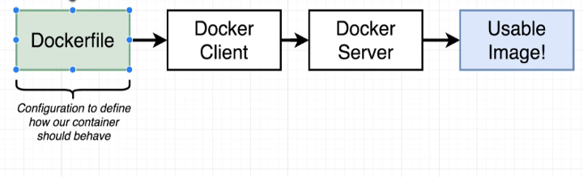
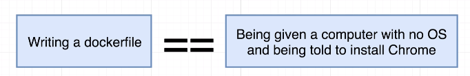

# Dockerfile
A **Dockerfile** is essentially a plain text file that is going to have a couple of lines of configuration placed inside of it. This configuration is going to define how our container behaves or more specifically, what different programs it's going to contain and what it does when it starts up as a container.

Once we create that, **Dockerfile** will then pass it off to the **Docker Client** which is the **Docker CLI**. The **Docker Client** will provide the file to the **Docker Server**. The **Docker Server** is doing the heavy lifting for us. It's going to take the **Dockerfile**, look at all the lines of configuration that we have inside of it and then build a usable image that can be used to start up a new container.



Inside of every **Dockerfile**, we're always going to specify a base image. After that, we'll add in some additional configuration to run commands, to add in some dependencies or some more software, some more programs that we need to successfully create and execute our container. And then finally, we will specify a startup command for the image.


<br />

## Building Dockerfile
Create a new file called **Dockerfile** and notice how it has a capital `D` and it has no extension.

**Example**
```Dockerfile
# Use an existing docker image as base
FROM alpine

# Download and install a dependency
RUN apk add --update redis

# Tell the image what to do when it starts as a container
CMD ["redis-server"]
```

To build the image
```
dev@dev:~$ docker build .
Sending build context to Docker daemon 2.04kB
Step 1/3: FROM alpine
......
Successfully built fc60771ecq08
:redis-image$ docker run fc60771ecq08
```

<br />

## Dockerfile Teardown
Every line started off with a single word that we refer to as an instruction. This instruction is telling the Docker Server to do some very specific preparation step on the image that we are trying to create.


The instruction `FROM` is used to specify the image that we want to use as a base. The `RUN` instruction is used to execute some command while we are preparing our custom image. And then the `CMD` or command instruction specifies what should be executed when our image is used to start up a brand new container. Every line of configuration that you are ever going to add to a **Dockerfile** is always going to start off with an instruction.

After each instruction, we then provided an argument to the instruction that kind of customized how that instruction was executed. So as you might guess, by putting `FROM alpine`, we are saying we want to use a base image of  `alpine` when preparing our image.

<br />

## What's Base Image?
Writing a **Dockerfile** is a little bit just like being given a computer. So a brand new computer with no operating system on it and being told to install Google Chrome on there.



So the purpose of a specifying a `base image` is to kind of give us an initial starting point or an initial set of programs that we can use to further customize our image. So that is the purpose of that first line, the `FROM alpine`. We said that we wanted to use the alpine docker image as kind of an initial operating system or a starting point for the image that we are creating.

We are trying to install and run `redis` and the `alpine` base image has a set of programs inside of it that are very useful for installing and running redis. The command that was or the program that was most useful for you and I for installing and running redis was found on the second line of the Dockerfile, `RUN apk add --update redis`. `APK` is a program called Alpine Package something I think. It is a package manager that comes preinstalled on the alpine image and we can use that package manager that is built into alpine to automatically download and install redis for us.

<br />

## Build Process
```
dev@dev:~$ docker build .
```

When we create our **Dockerfile**, we then feed it into the **Docker Client**, which turns around and gives your file off to the **Docker Server**, and that's what builds your usable image. So when we ran `docker build`, that was us giving our **Dockerfile** off to the **Docker CLI**.

The `build` command is what we use to take a **Dockerfile** and generate an image out of it. The `.` (`docker build .`) is specifying what is called the **build context**. The **build context** is essentially the set of files and folders that belong to our project. It's a set of files and folders that we want to kind of encapsulate or wrap in this container.

```
Step 1/3 : FROM alpine
```
With the very first step where we said `FROM alpine`, the first thing that occurred was that **Docker Server** looked at our local build cache and it checked to see if it has ever downloaded an image called alpine before. We basically just downloaded an initial starting image to use as a base.

```
Step 2/3 : RUN apk add -- update redis
---> Running in 30c5aa616f98
......
Removing intermediate container 30c5aa616f98
```
You'll notice the first line right here says `Running in 30c5aa616f98`.  Then a little bit lower, you'll notice that it says `Removing intermediate container` and it printed out the exact same ID that we saw back up there.

```
Step 3/3 : CMD [“redis-server”]
---> Running in 38ec9aea7e10
......
Removing intermediate container 38ec9aea7e10
---> fc60771ae08
Successfully build fc60771ae08
```
You'll notice that there is no kind of like intermediate container printout. So it appears that for every instruction that we added to the **Dockerfile**, besides the first one, it appears that some like container of sorts was created. So the first thing we did was specify `FROM alpine` that basically went out and downloaded the alpine image off of **Docker Hub**. Remember that an image has a file system snapshot and some start up commands.

The next line was the `RUN apk add --update redis`. When **Docker Server** saw this line of configuration, it looked back at the last step that just occurred. So it looked back at the `FROM alpine` step. It looked at the image that came out of that previous step. The image that came out of the previous step was the alpine image then on the `RUN` line, it took that image and created a new container out of it. So in memory, we temporarily got a brand new container created at the very start of step number two. And that's what this `Running in 30c5aa616f98` means. It means that it created a temporary container out of the image that was sourced during the previous step. **APK** is a package manager that is built into the alpine image. So this command executed inside the container and while it executed, it went through the process of downloading redis.

After that package was installed, we then stopped that container. We took a filesystem snapshot of that container and then we stopped it entirely. So we're saying right here that temporary container that was just created, we stop it and we then take its current file system snapshot and we save it as a temporary image with the ID. So the output of everything inside of step number two is a new image that contains just the changes that we made during the step.

In total, we created a temporary container out of the alpine image. We executed this, `RUN apk add --update redis`, command inside that container and then we took that containers file system and saved it as a temporary image. So we now have this very temporary file system snapshot right here that has redis included.

On step number three where we execute `CMD` so that you can imagine what happens here. With `CMD` we're going to look at the image that was generated during the previous step. We create a new very temporary container out of it and when we make that container, we take the images file system snapshot and stuff it into this container. And then with the `CMD`, this is setting the primary command or the primary process of the container. So the container does not actually execute `redis-server`. It doesn't execute this command. It just tells the container, “Hey, like just you know, if you were to ever run for real, you should be running a server as your primary command”.

So the container is told “This is supposed to be your intermediate or something”. This is supposed to be your primary command (`Removing intermediate container 38ec9aea7e10`) and then it shuts down that container (`---> fc60771ae08`) and it takes a snapshot (`Successfully build fc60771ae08`) of its file system and its primary command. So the end result is `Successfully build fc60771ae08`. This is the final image (`fc60771ae08`) that was created out of this entire series of steps. So in step number three, at the very end we remove the intermediate container. We take a snapshot of its file system and its primary command, and then we save it as an output, as an image with an idea of `fc60771ae08`.

