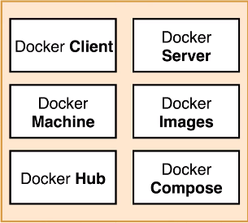
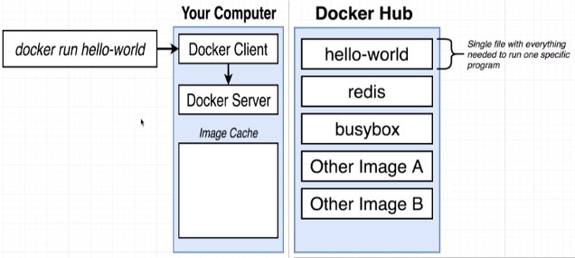
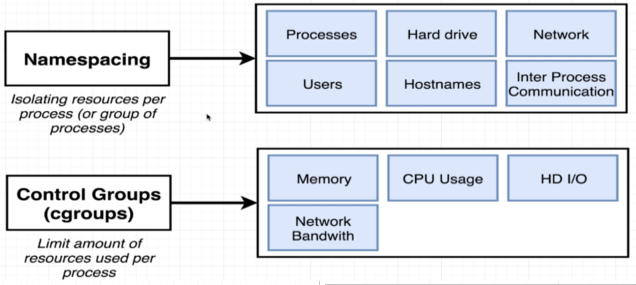
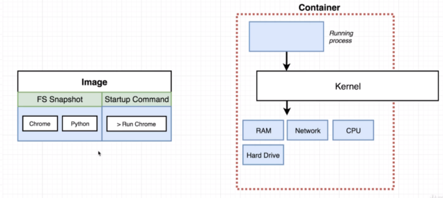

# Getting Started

## Why use Docker?
Docker makes it really easy to install and run software without worrying about setup or dependencies.

## What is Docker
Docker is a platform or ecosystem around creating and running containers.

<center>



</center>

## What is an Image or Container?
* An `image` is a single file containing all the dependencies and all configuration required to run a very specific program. This is a single file that gets stored on your hard drive.
* A `container` is an instance of an image and you can kind of think of it as being like a running program. It is a program with its own isolated set of hardware resources. So it kind of has its own little set or its own little space of memory, has its own little space of networking technology and its own little space of hard drive space as well.

<center>


</center>

<br /><br />

# Using Docker Client

<center>



</center>

**Example**
```
dev@dev-PC:~$ sudo docker run hello-world
Unable to find image ‘hello-world:latest’ locally
latest: Pulling from library/hello-world
b8dfe127a29: Pull complete
Digest: sha256:9f6ad537c5132bcce57f7a0a20e317228d382c3cd61edae14650eec68b2b345c
Status: Downloaded newer image for hello-world:latest

Hello from Docker!
This message shows that your installation appears to be working correctly.
```

## Docker CLI (Docker Client)
The **Docker CLI** is in charge of taking commands from you, kind of doing a little bit of processing on them and then communicating the commands over to something called the **Docker Server**.

## Docker Server
It's in charge of the heavy lifting. When you ran the command `$ docker run hello-world`, that meant that you wanted to start up a new container using the image with the name of `hello-world`. The first thing that the **Docker Server** did was check to see if it already had a local copy, like a copy on your personal machine of the `hello-world` image or that `hello-world` file. So the **Docker Server** looked into something called the `image cache`. If the image cache is empty, the **Docker Server** decided to reach out to a free service called **Docker Hub**.

## Docker Hub
The **Docker Hub** is a repository of free public images so you can freely download and run on your personal computer.

<br /><br />

# Namespacing and Control Groups
Namespacing and Control Groups belong to **Linux**. Not to Windows. Not to MAC OS.
<center>



</center>

**Namespacing** is not only used in hardware, it can be also used for software elements as well. So these two features put together can be used to really kind of isolate a single process and limit the amount of resources it can talk to and the amount of bandwidth essentially that it can make use of.

A `container` is really a process or set of processes that have a grouping of resources specifically assigned to it and every time that we talk about an `image`, we're really talking about a file system snapshot.
<center>



</center>

<br /><br />

# How's Docker Running on your computer?
When you installed **Docker for Windows** or **Docker for Mac**, you installed a Linux virtual machine. So as  long as Docker app is running, you technically have a Linux virtual machine running on your computer. Inside of the virtual machine is where all these containers are going to be created. So inside the virtual machine, we have a Linux kernel and that Linux kernel is going to be hosting running processes inside of containers and it's that Linux kernel that's going to be in charge of limiting access or kind of constraining access or isolating access to different hardware resources on your computer.
<center>


</center>
