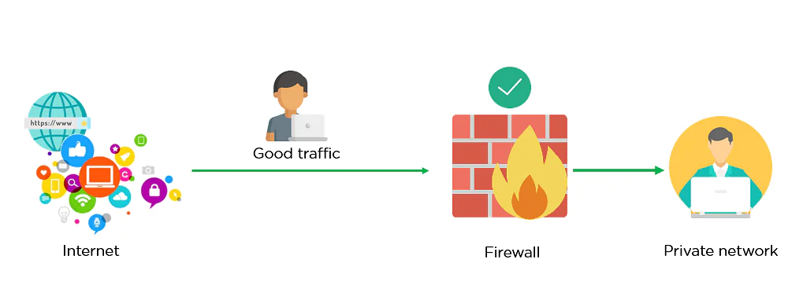

# Firewall

### What is a Firewall?
Firewalls are network security systems that prevent unauthorized access to a network. It can be a hardware or a software unit that filters the incoming and outgoing traffic wihtin a private network, according to a set of rules to spot and prevent cyberattacks. Firewalls are used in both personal and enterprise settings, and many devices come with one built-in, including Mac, Windows, and Linux Computers. It's typically placed in a forwarding path so that all packets have to be checked by the firewall, where we can drop or permit them.

Above we have our LAN that has a host computer and a switch. On the right side, there’s a router that is connected to the ISP which offers Internet connectivity. The firewall sits in between to protect our LAN. The router is optional, it depends on your connectivity to the WAN. Most firewalls support some basic routing options: static routes, default routes and sometimes routing protocols like RIP, OSPF or EIGRP.

### How does a Firewall work?
Think of the firewall like a gatekeeper at your computer's entry point which only allows trusted sources, or IP addresses, to enter your network. A firewall welcome only those incoming traffic that has been configured to accept. It distinguishes between good and malicious traffic and either allows or blocks specific data packets on pre-established security rules.

Image depicted below shows how a firewall allows a good traffic to pass to the user's private network.

In here, the firewall blocks malicious traffic from entering the private network, thereby protecting the user's network from being susceptible to a cyberattack.

## Stateful Firewall

A **stateful firewall** inspects everything inside data packets, the characteristics of the data, and its channels of communication. Stateful firewalls examine the behaviour of data packets, and if anything seems off, they can filter out the suspicious data. Also, a stateful firewall can track how the data behaves, cataloging patterns of behaviour.

Stateful firewalls are capable of monitoring all aspects of network traffic, including their communication channels and characteristics. They are also referred to as dynamic pocket filters as they filter traffic packets based on the context and state.

* **Context** – it involves metadata of packets including ports and IP address belonging to the endpoint’s and destination, packet length, layer 3 information related to reassembly and fragmentation, flags, and numbers for TCP sequence of layer 4, and more.
* **State** – firewalls apply their policy based on the state of the connection. To understand the state, let’s take the example of TCP-based communication. In TCP, 4 bits control connection state – SYN, ACK, FIN, and RST.

## Stateless Firewall

A **stateless firewall** make use of a data packet's source, destination, and other parameters to figure out whether the data presents a threat. On detecting a possible threat, the firewall blocks it. There are certain preset rules that firewalls enforce while deciding whether traffic must be permitted or not. These parameters have to be entered by either an administrator or the manufacturer via rules they set beforehand.

# Reference
* [Firewall](https://www.techtarget.com/searchsecurity/definition/firewall)
* [Introduction to Firewalls](https://networklessons.com/cisco/asa-firewall/introduction-to-firewalls)
* [Stateful & Stateless Firewall Differences](https://www.fortinet.com/resources/cyberglossary/stateful-vs-stateless-firewall)
* [What are Stateful and Stateless Firewalls?](https://geekflare.com/stateful-vs-stateless-firewalls/)
* [What Is Firewall: Types, How Does It Work, Advantages & Its Importance](https://www.simplilearn.com/tutorials/cyber-security-tutorial/what-is-firewall)