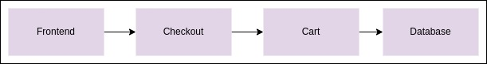
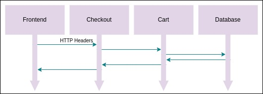
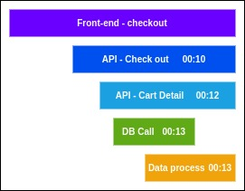

# Traces
A Trace is the ability to drill down. It gives us a picture of what happens when a request is made by the user or an application. A Trace represents the flow of a single transaction or request as it goes through the system. They provide a holistic view of the chain events triggered by requests and are defined by a tree of nested spans — one for each unit of work they represent and a parent span.

Let's say when you are doing checkout in the Shop, the front-end calls the checkout services, the checkout services will call the cart services to get the cart and the cart will interact with the database.

When the checkout services receive the call from the front-end and just before interacting with the cart services, the checkout services will look at the HTTP request headers to get the trace context. So the trace context holds the tracing information to glue the spans together. The checkout services can either utilize if there is an existing trace context at the existing one or it will create a new one with a new span and a new span will have a name and a timestamp.

Here, we have the checkout API call at that given timestamp and then it will be added to the trace context in the HTTP request that it will send to the cart services. The cart services receive the request, collect the trace context, and will also add their own span. You can track the interaction with the database so you have a database call and then after we receive the database information, and process the data in order to do stuff and send back the response to the checkout services.

## Code Instrumentation Components

### Tracer Provider
A **Tracer Provider** is a factory for Tracer. In most applications, it is initialized once and its lifecycle matches the application's lifecycle. Tracer Provider initialization includes Resource and Exporter initialization. It is typically the first step in tracing with OpenTelemetry.

### Tracer
A **Tracer** creates spans containing more information about what is happening for a given operation, such as a request in service. Tracers are created from Tracer Providers.

### Trace Exporters
**Trace Exporters** send traces to a consumer. This consumer can be standard output for debugging and development-time, the OpenTelemetry Collector, or any open-source or vendor backend of your choice.

### Trace Context
**Trace Context** is metadata about trace spans that provides correlation between spans across service and process boundaries.

## Reference
* [Introduction to OpenTelemetry](https://www.youtube.com/watch?v=dfpGU9al_i4)