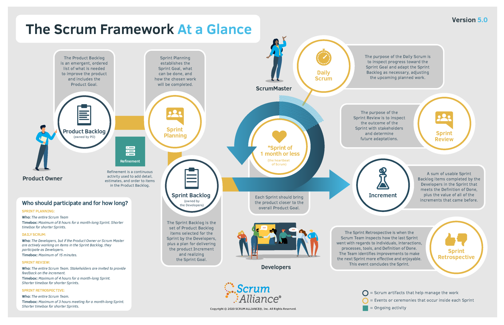

# Introduction
Agile refers to a set of “methods and practices based on the values and principles expressed in Agile Manifesto”, which includes things like collaboration, self-organization, and cross functionality of teams. The difference between agile and scrum is that *agile* refers to a set of principles and values shared by several methodologies, processes, and practices; *scrum* is one of several agile frameworks—and is the most popular.

Scrum relies on cross-functional teams to deliver products and services in short cycles, enabling:
* Fast feedback
* Quicker innovation
* Continuous improvement
* Rapid adaptation to change
* More delighted customers
* Accelerated pace from idea to delivery

## What is Scrum?

It is a framework for new product development. "A lightweight framework that helps people, teams and organizations generate value through adaptive solutions for complex problems". Scrum is hard to practice. It takes couragement and commitment. It is **simple to understand**, but **difficult to master**.

### Manifesto for Agile Software Development
   We are uncovering better ways of developing software by oding it and helping others do it. Through this work we have come to value:
   * **Individuals and interactions** over processes and tools
   * **Working software** over comprehensive documentation
   * **Customer collaboration** over contract negotiation
   * **Responding to change** over following plan

   That is, while there is value in the items on the right, we value the items on the left more.

### Sprint
Every sprint contains every some combination of analysis, design, actual implementation, testing, planning for the future, maybe will be actually shipping or deploying more frequently.

## Scrum Elements – Roles

### Product Owner
The Product Owner is responsible for Return On Investment(ROI), final arbiter of requirements questions and focused more on the *what* than on the *how*.

Product Owners perform the following activities in Scrum
   * Set product goals
   * Ensure that the product backlog is stocked with clearly expressed items that help reach the product goal
   * Order the backlog
   * Regularly update and refine the backlog together with the developers
   * Collect feedback from users, customers, and stakeholders on the product increments
   * Agree on sprint goals with the developers

### Scrum Dev Team

Teams of developers are structured and empowered to organize and plan how to accomplish their work at an agreed upon level of quality—the definition of done. Developers work together to accomplish the sprint goal, checking in with each other at least daily to inspect and adapt their plan. They attempt to build a "potentially shippable product increment" every sprint.

Developers perform the following activities:
   * Manage the sprint backlog
   * Inspect and adapt through a daily scrum
   * Contribute to the sprint goal

Great teams of developers have the following characteristics:
* **Self-organizing**
   * Decide how to turn product backlog into increments of potentially releasable functionality
* **Cross-functional**
   * Together, the developes have all the skills necessary to create a product increment
* **One-team mentality**
   * Scrum assigns no titles to development team members, regardless of the work being performed by the person.

### Scrum Master
The Scrum Master has no management authority and doesn't have a project manager role. Master is used here to mean "an artist, performer, or player of consummate... skill".

They help the scrum team perform at their highest level and they aslo protect the team from both internal and external distractions.

Scrum Masters perform the following activities:
* **Coach**
   * Facilitate meetings, conversations and improvements
* **Protector**
   * Run interference so the team can remain focused
* **Leader**
   * Lead without any authority and puts the team first
* **Advocate**
   * Reinforce agile principles throughout the organization

## Scrum Elements – Artifacts

### Product Backlog
* Everything we might ever do
* An emergent, ordered list of what is needed to improve the product and includes the product goal

### Sprint Backlog
* What we have agreed to do during the current Sprint
   * Committed Backlog Items (representing *What*)
   * Sprint Tasks (Not Started, In Progress, Completed | representing *How*)
* The set of Product Backlog Items selected for the sprint by the developers, plus a plan for delivering the increment and realizing the sprint goal

### Increment
* A sum of usable sprint backlog items completed by the developers in the sprint that meets the definition of done, plus the vlaue of all the increments that came before. Each increment is a recognizable, visibly improved, operating version of the product

## Scrum Elements – Meetings

### Sprint Planning Meeting
* Product Increment selected during the Sprint Planning Meeting
* The entire scrum team establishes the sprint goal, what can be done, and how the chosen work will be completed. Planning should be timeboxed to a maximum of 8 hours for a month-long sprint, with a shorter timebox for shorter sprints. 

### Daily Scrum
* What I did yesterday
* What I will do today
* Issues encountered
* The developers (team members delivering the work) inspect the progress toward the sprint goal and adapt the sprint backlog as necessary, adjusting the upcoming planned work. A daily scrum should be timeboxed to 15 minutes each day. 

### Sprint Review Meeting
* Provides a feedback loop
* The entire scrum team inspects the sprint's outcome with stakeholders and determines future adaptations. Stakeholders are invited to provide feedback on the increment.

### Sprint Retrospective Meeting
* What went well
* What could be improved
* What we learned
* Feedback to each other
* The scrum team inspects how the last sprint went regarding individuals, interactions, processes, tools, and definition of done. The team identifies improvements to make the next sprint more effective and enjoyable. This is the conclusion of the sprint. 

### Backlog Refinement Meeting
* Backlog Grooming
* Refinement is a continuous activity used to add details, estimates, and order to items in the product backlog. Some teams prefer a recurring meeting, usually done once per sprint or per week; other teams find making refinements continuously as needed is sufficient.

## Reference
* [Scrum Team](https://resources.scrumalliance.org/Article/scrum-team)
* [About Scrum](https://www.scrumalliance.org/about-scrum)
* [Introduction to Scrum](https://www.collab.net/services/training/agile_e-learning#b1)
* [Manifesto for Agile Software Development](http://agilemanifesto.org/)