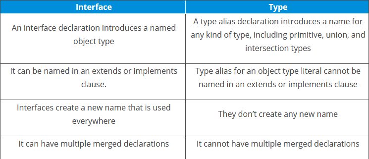

# TS – Interfaces

Interface is a structure that defines the contract in your application. It defines the syntax for classes to follow. Classes that are derived from an interface must follow the structure provided by their inheritance. The TypeScript compiler does not convert interface to JavaScript. It uses interface for type checking. This is also known as "*duck typing*" or "*structural subtyping*".

An interface is defined with the keyword `interface` and it can include properties and method declaration using a function or an arrow function. Interfaces contain only the declaration of members. It is the responsibility of the deriving class to define the members. It often helps in providing a standard structure that the deriving classes would follow.

Syntax:
```typescript
interface interface_name {}
```

Example:
```typescript
interface IComplexType
{
   id: number;
   name: string;
}

let complexType : IComplexType = {id: 1, name: 'John'};
```

## Optional properties
An interface may have optional properties. To declare an optional property, you use the question mark (`?`) at the end of the property name un the declaration.

Example:
```typescript
interface User {
   first_name: string;
   middle_name?: string;
   last_name: string;
}
```

## Readonly properties
If properties should be modifiable only when the object first created, you can use the `readonly` keyword before the name of the property.

Example:
```typescript
interface User {
   readonly id_number: string;
   first_name: string;
   middle_name?: string;
   last_name: string;
}

let user: User;
user = {
   id_number: '0098172018',
   first_name: 'John',
   last_name: 'Doe'
}
console.log(user);
```

Output:
```
{
  "id_number": "0098172018",
  "first_name": "John",
  "last_name": "Doe"
}
```

The `user.id_number` syntax will throw an error because the property cannot be changed.
```typescript
user.id_number = '0089200107';]
```

Error:
```
Cannot assign to 'id_number' because it is a read-only property.
```

## Type Aliases vs. Interfaces
**Type Aliases** is basically a name for any type. It can be used to represent not only primitives but aslo object types, union types, tuples and intersections. Type aliases are declared with the `type` keyword preceding them.

**Interfaces** are another way to name data structure like objects. An interface may only be used to declare the shapes of objects, not rename primitives. Interfaces are declared with the `interface` keyword preceding them.



## Reference
* [TypeScript Interface](https://www.typescripttutorial.net/typescript-tutorial/typescript-interface/)
* [TypeScript - Interfaces](https://www.tutorialsteacher.com/typescript/typescript-interface)
* [TypeScript - Interfaces](https://www.tutorialspoint.com/typescript/typescript_interfaces.htm)
* [Everyday Types – Interfaces](https://www.typescriptlang.org/docs/handbook/2/everyday-types.html#interfaces)
* [Type Aliases vs Interfaces in TypeScript](https://dev.to/toluagboola/type-aliases-vs-interfaces-in-typescript-3ggg)