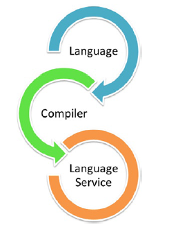

# TypeScript

## TypeScript Components



The compiler performs the type erasure and code transformations that convert your TypeScript code into JavaScript. It will emit warnings and errors if it detects problems and can perform additional tasks such as combining the output into a single file, generating source maps, and more.

### Language
It features the TypeScript language elements. It comprises elements like syntax, keywords, and type annotations.

### Compiler
The TypeScript Compiler (TSC) transform the TypeScript program equivalent to its JavaScript code. It also performs the parsing, the type checking of our TypeScript code to JavaScript code. Browser doesn't support the execution of TypeScript code directly. So the program written in TypeScript must be re-written in JavaScript equivalent code which supports the execution of code in the browser directly. We can compile the TypeScript file by running `tsc` command on the command line.

### Language Services
The language service provides information which helps editors and other tools to give better assistance features such as automated refactoring and IntelliSense. It exposes an additional layer around the core-compiler pipeline. It supports some standard typical editor operations like code formatting and outlining, colorization, statement, completion, signature help, etc.

## Type Annotations
We can specify the type using `:Type` after the name of the variable, parameter of property. There can be a space after the colon (`:`).

```typescript
let variable_name: type_annotation = value;
let variable_name: type_annotation;
let variable_name = value;

// Example Type Annotation with different data types
let name: string = "John";
let age: number;
let isUpdated = true;
```

In the example above, you cannot change the value using a different data type other than the declared data type of a variable. If you try to do so, TypeScript will show an error. This helps in catching JavaScript errors. Type Annotations are used to enforce type checking. However, it helps the compiler in checking types and helps avoid errors dealing with data types.

#### Type Annotation of Parameters
Basic syntax:
```typescript
function functionName(param_1: string, param_2: number)
{
   // code block here
}
```

Example:
```typescript
function display(id: number, name: string)
{
   console.log(`Id = ${id}, Name = ${name}`);
}
```

#### Type Annotation in Object
Basic syntax:
```typescript
let variable_name {
   obj_1: string;
   obj_2: number;
};
```

```typescript
let employee {
   id: number;
   name: string;
};
```

## Reference
* [Components of TypeScript](https://www.javatpoint.com/typescript-components)
* [TypeScript - Type Annotations](https://www.tutorialsteacher.com/typescript/type-annotation)